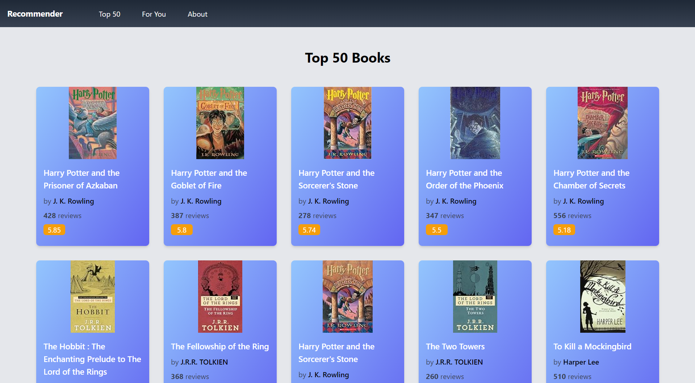
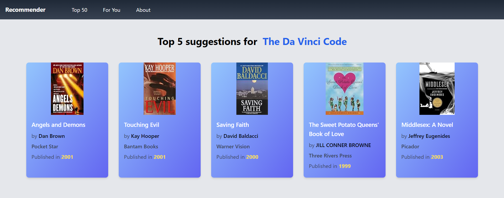

<h1 align="center">Book Recommendation System</h1>

This is a book recommendation website created using the **Flask** framework that makes book recommendations to the user based on a dataset from **Kaggle**. It leverages the **collaborative filtering** method of creating recommendation systems.

## Previews
### Top 50 Books

- **Top 50** books from the dataset based on **average ratings** are displayed on the `/top50` route.

### Recommendations

* Based on the user input, **Top 5** recommendations are displayed on the `/recommend` route.
* These recommendations are made on the basis of **cosine similarity** scores of the books with respect to the book provided as user input.

## Dataset link
[Book Recommendation Dataset](https://www.kaggle.com/datasets/arashnic/book-recommendation-dataset)

## Deployment link
[Book Recommender System](https://book-recommender-system-olce.onrender.com/)
